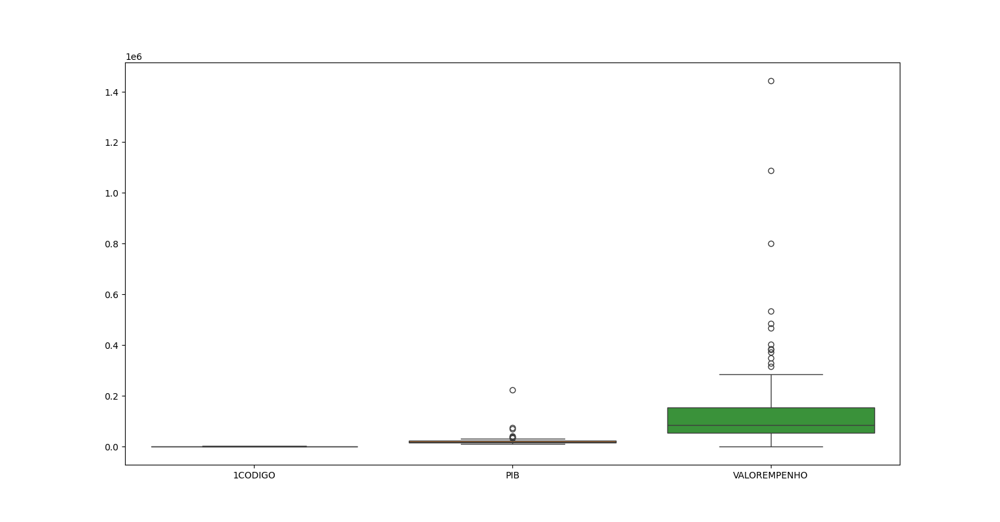

# Análise Exploratória de Municípios Gaúchos: Empenho em Diárias e PIB

## Descrição
Este projeto realiza uma análise exploratória dos dados de municípios gaúchos, com foco no valor empenhado em diárias e no PIB dos municípios. O objetivo é verificar a relação entre o PIB e o valor empenhado, identificar possíveis outliers e avaliar a eficiência no uso de recursos.

## Passos Realizados

### 1. Leitura e Pré-processamento de Dados
O primeiro passo foi a leitura do arquivo CSV, que continha caracteres não reconhecidos, como ponto e vírgula e espaços nos nomes das colunas.

#### Tratamento de Dados:
- **Substituição de Ponto e Vírgula**: Utilizou-se a função **Ctrl + F** para substituir ponto e vírgula (**;**) por vírgula (**","**).
- **Substituição de Espaços**: Substituímos os espaços nos nomes das colunas por **_** (underline) para garantir que não houvesse problemas ao acessar as colunas.

### 2. Análise Inicial dos Dados
```python
# Carregando o arquivo CSV
dados = pd.read_csv('dados.csv')

# Verificando duplicatas
dados_dup = dados.duplicated().sum()
print(dados_dup)

# Verificando valores nulos
dados_null = dados.isnull().sum()
print(dados_null)
```
Foram verificadas duplicatas e valores nulos. Nenhum valor nulo foi encontrado, mas a quantidade de duplicatas foi identificada.

### 3. Análise Visual

#### Gráficos de Boxplot para Identificação de Outliers
```python
# Boxplot para verificar outliers em todas as colunas
sb.boxplot(dados)
plt.show()
```

# Boxplot para verificar outliers no valor empenhado

```python
sb.boxplot(dados['VALOREMPENHO'])
plt.show()
```
#### Análise de Relação entre PIB e Valor Empenhado
```python
# Gráfico de dispersão entre PIB e Valor Empenhado
sb.scatterplot(x=dados['PIB'], y=dados['VALOREMPENHO'])
plt.title('Relação entre PIB e Valor Empenhado dos Municípios')
plt.xlabel('PIB')
plt.ylabel('Valor Empenhado')
plt.show()
```

#### Regressão Linear
```python
# Regressão linear entre PIB e Valor Empenhado
sb.regplot(x=dados['PIB'], y=dados['VALOREMPENHO'])
plt.title('Relação entre PIB e Valor Empenhado com Regressão Linear')
plt.xlabel('PIB')
plt.ylabel('Valor Empenhado')
plt.show()
```


### 4. Análise de Eficiência no Uso dos Recursos

#### Identificação de Municípios com PIB Menor que o Valor Empenhado
```python
# Municípios com PIB menor que o valor empenhado
pib_menor_que_empenho = dados['PIB'] < dados['VALOREMPENHO']
quantidade_municipios = pib_menor_que_empenho.sum()
print(f'Quantidade de municípios com possíveis ineficiências: {quantidade_municipios}')

# Exibindo os municípios com PIB menor que o valor empenhado
pib_menor_que_empenho = dados[pib_menor_que_empenho]
print(pib_menor_que_empenho)
```

#### Identificação de Municípios com PIB Maior que o Valor Empenhado
```python
# Municípios com PIB maior que o valor empenhado
pib_maior_que_empenho = dados['PIB'] > dados['VALOREMPENHO']
quantidade_municipios_pib = pib_maior_que_empenho.sum()
print(f'Quantidade de municípios com possível eficiência no uso dos recursos: {quantidade_municipios_pib}')
```
# Exibindo os municípios com PIB maior que o valor empenhado
```python
pib_maior_que_empenho = dados[pib_maior_que_empenho]
print(pib_maior_que_empenho)
```

### 5. Visualizações Adicionais

#### Histogramas
```python
# Histograma de PIB para municípios com PIB maior que o valor empenhado
sb.histplot(pib_maior_que_empenho['PIB'], kde=True)
plt.title('Distribuição do PIB para Municípios com PIB maior que o Valor Empenhado')
plt.xlabel('PIB')
plt.ylabel('Frequência')
plt.show()
```

# Histograma de PIB para municípios com PIB menor que o valor empenhado
```python
sb.histplot(pib_menor_que_empenho['PIB'], kde=True)
plt.title('Distribuição do PIB para Municípios com PIB menor que o Valor Empenhado')
plt.xlabel('PIB')
plt.ylabel('Frequência')
plt.show()
```


## Conclusões
- Foram identificados municípios com possíveis ineficiências no uso de recursos (PIB menor que o valor empenhado).
- Identificamos municípios com possível eficiência no uso de recursos (PIB maior que o valor empenhado).
- Esses insights podem auxiliar na tomada de decisões sobre a alocação e o uso de recursos públicos.

## Considerações Finais
A análise exploratória realizada trouxe insights valiosos sobre os municípios gaúchos. Para um estudo mais aprofundado, seria interessante realizar uma análise preditiva para verificar fatores que influenciam esses padrões.